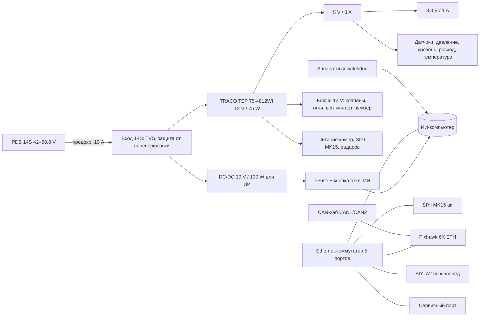

# АГД6.07.010 — центральная плата авионики гексакоптера X6

Статус: `DRAFT` · `NOT_FOR_MANUFACTURE` · `NOT_FOR_FLIGHT`
САПР: KiCad (файлы создаются в формате KiCad 7, открываются в KiCad 10)

Плата объединяет три прежние платы проекта — CAN-хаб, модуль ключей 12 V и плату
сопряжения датчиков — и добавляет питание и связь для бортового ИИ-компьютера и камер.

## 1. Что НЕ входит в плату

| Узел | Почему отдельно |
|---|---|
| Аккумулятор 14S и его BMS | Съёмный модуль, меняется вместе с батареей |
| Силовая шина 14S (PDB), главный предохранитель 250 A, 6 × предохранители лучей | Токи до 200 A — только медная шина/PDB, не дорожки PCB |
| Power module Mauch 076 (основной) и Mauch 085 (резервный) | Питают Pixhawk напрямую, независимо от этой платы |
| Регуляторы FOC 80 A, насос Hobbywing 5L | Питаются от PDB 14S; с платы идут только сигналы |
| Система аварийного прекращения полёта (FTS) | Должна работать при отказе этой платы — собственное питание и канал |
| ИИ-компьютер | Сменный модуль (см. п. 3), на плате — питание и интерфейсы |

## 2. Структура платы (иерархические листы схемы)

| Лист | Содержимое | Источник |
|---|---|---|
| `power_in` | Вход 14S, TVS, переполюсовка, TEP 75-4812WI, 5 V, 3.3 V | новая + старые платы |
| `ai_power` | DC/DC 19 V, eFuse, отключение, мониторинг тока | новая |
| `can_hub` | CAN1/CAN2, терминаторы с перемычками, разъёмы узлов | плата CAN-хаба |
| `switches_12v` | Ключи клапанов, огней, вентилятора, зуммера; диоды/TVS на индуктивных нагрузках | модуль ключей 12 V |
| `sensors` | Давление, уровень, расходомер, температура | плата сопряжения датчиков |
| `ethernet` | Коммутатор, магнетики/трансформаторная развязка, разъёмы | новая |
| `ai_interface` | UART MAVLink ↔ Pixhawk, PPS от GNSS, watchdog, reset | новая |
| `connectors` | Все внешние разъёмы с TVS/ESD | новая |

## 3. ИИ-компьютер — универсальное место под два варианта

| | Вариант А: распознавание растений, точечное опрыскивание | Вариант Б: помощь оператору, видеоаналитика |
|---|---|---|
| Модуль | Jetson Orin NX 16 GB на компактной плате-носителе | Jetson Orin Nano 8 GB или RK3588 |
| Потребление | до 40 W (режим MAXN) | 10–25 W |
| Камера ИИ | глобальный затвор, Ethernet/MIPI | не обязательна (SIYI A2 mini) |

Питание 19 V / 100 W рассчитано на вариант А, вариант Б работает от того же разъёма.
Разъём ИИ-модуля: 19 V, GND, Ethernet, UART (MAVLink к Pixhawk TELEM), PPS от GNSS,
RESET от watchdog, сигнал включения. Отказ ИИ не должен влиять на Pixhawk:
ручное управление SIYI MK15 → Pixhawk работает без ИИ.

## 4. Внешние подключения

| Группа | Подключение | Интерфейс | Питание с платы |
|---|---|---|---|
| Автопилот | Pixhawk 6X | CAN1, CAN2, ETH, TELEM2 (UART) | нет (свои power module) |
| Навигация | H-RTK F9P | CAN | через CAN-хаб |
| Навигация | 2-й GNSS/компас (резерв) | CAN | через CAN-хаб |
| Высота | Ainstein US-D1 | `DATA_REQUIRED` (CAN/UART) | 12 V или 5 V |
| Препятствия | радары вперёд/назад | `DATA_REQUIRED` | 12 V |
| Связь | SIYI MK15 air unit | ETH + UART/SBUS к Pixhawk | 12 V |
| Камеры | SIYI A2 mini (вперёд), нижняя камера, камера ИИ | ETH / по модели | 12 V |
| Remote ID | модуль Remote ID | CAN/UART | 5 V |
| Опрыскивание | насос Hobbywing 5L | PWM (сигнал) | нет (PDB 14S) |
| Опрыскивание | клапаны форсунок × `DATA_REQUIRED` | ключ 12 V | 12 V |
| Опрыскивание | расходомер | импульсный вход | 5 V |
| Опрыскивание | датчик давления | аналог 0.5–4.5 V | 5 V |
| Опрыскивание | датчик уровня | `DATA_REQUIRED` | 5 V |
| Огни | навигационные, anti-collision | ключ 12 V | 12 V |
| Сервис | USB, Ethernet | герметичные разъёмы с заглушкой | — |
| Климат | датчики температуры, вентилятор ИИ | I2C, ключ 12 V | 3.3 V / 12 V |

## 5. Требования к PCB

- 4 слоя: сигнал / GND / питание / сигнал; медь внешних слоёв 2 oz (ключи 12 V).
- Контур: предварительно 70 × 130 мм, рядом с аккумуляторным лотком на верхней пластине
  Ø400 мм. Точный контур и вырезы — `DATA_REQUIRED` (нужен образец аккумулятора 216 × 111 × 83 мм).
- Разделение зон: силовая 14S/DC-DC, ключи 12 V, аналоговые датчики, цифровая/Ethernet.
  Возвратные токи клапанов не проходят под аналоговой частью.
- Все внешние разъёмы — с TVS/ESD; разъёмы с защёлкой (JST-GH / Molex CLIK-Mate) или
  герметичные для выносных узлов.
- Влагозащитное покрытие (лак) — плата работает рядом с агрохимикатами.
- Тестовые точки на всех шинах питания, светодиоды наличия питания.
- Магнитометр на плате не размещается: компас — только на мачте GNSS.

## 6. Открытые вопросы (`DATA_REQUIRED`)

1. Схемы трёх исходных плат KiCad — загрузить в `hardware/source_boards/`.
2. Точный контур платы и крепёжные отверстия (после образца аккумулятора).
3. Количество клапанов форсунок и их ток.
4. Модели радаров препятствий, нижней камеры и камеры ИИ.
5. Потребление SIYI MK15 air unit, A2 mini, US-D1 — по документации производителя.
6. Есть ли на плате сопряжения датчиков микроконтроллер (узел DroneCAN) — из исходной схемы.

## 7. Блокеры проекта (вне этой платы)

- Сечение проводов лучей: 10 AWG в жгуте против 12 AWG в скрипте — утвердить одно.
- Предохранитель 125 A не защищает провод 10/12 AWG — проверить номинал (вероятно, 60–80 A).
- T/W = 2 требует 198.5 A при пределе батареи 175 A: ограничение `MPC_THR_MAX=0.522`
  подтвердить на стенде, либо перейти на 2 × 14S параллельно.
- Защита от искры при подключении батареи (AS150U или цепь предзаряда) — добавить в PDB.
