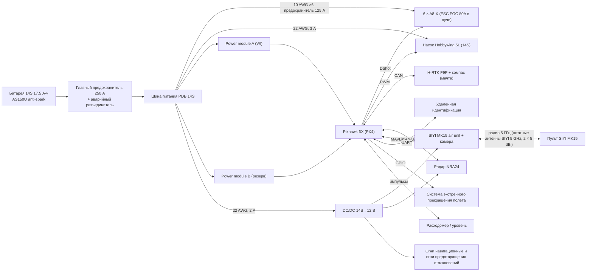

# Электроника и питание гексы X6 (MASTER PROMPT §93), ревизия 0.1, 2026-09-24

> Ревизия компоновки 2026-09-27: собственные платы АГД6.07.001/.002/.003
> объединяются в центральную АГД6.07.010; BMS и высокотоковый PDB остаются
> отдельными. Бортовой ИИ, две камеры и датчики препятствий описаны в
> `integrated_avionics_board.md`. До выбора компонентов новая часть имеет статус
> `DATA_REQUIRED / NOT_FOR_MANUFACTURE / NOT_FOR_FLIGHT`.

Расчёт: `drone_core/electrical.py` (5 тестов PASS), `tools/drone_electrical.py`.
Выходы: `electronics_wiring.csv`, `power_budget.csv`, `reports/drone_electrical.json`.
Исходные решения: гекса PNPNPN с наклоном 10°, 6 × T-Motor A8-X с ESC 14S FOC 80A, батарея DUPU 14S 17.5 А·ч (10C), Pixhawk 6X (PX4), H-RTK F9P, радар NRA24, SIYI MK15, насос Hobbywing 5L.

## Блок-схема

## Баланс мощности (ESTIMATED, 200 м / 35 °C)

| Режим | Мощность, Вт | Ток при 51.8 В | Ток при 49 В (разряд) | Батарея 10C = 175 А |
|---|---:|---:|---:|---|
| Висение + распыление, 30 кг | 3 310 | 64 А | 68 А | PASS |
| T/W 2, все роторы | 8 834 | 171 А | **180 А** | **MARGINAL: +3 % при 49 В** |
| Отказ мотора, висение с полным баком | 3 841 | 74 А | 78 А | PASS |

Авионика потребляет около 18 Вт (КПД DC/DC 0.88 — ASSUMPTION). Наиболее неопределённая позиция — воздушный модуль SIYI, `DATA_REQUIRED`.

**Отказ мотора.** Минимизирована максимальная тяга ротора при висении — это линейная задача. После отказа любого мотора оставшимся хватает 7.7 кгс на ротор, 43 % от максимума: 20 А на ESC и 78 А на шине, +18 % к мощности висения.
Грубое допущение «два мотора на полном газе» давало 202 А. Оно отброшено как неверное.

## Силовые провода (провод в силиконовой изоляции, медь при 60 °C; плотность тока ≤ 10 А/мм² длительно и ≤ 20 А/мм² до 30 с — ASSUMPTION)

| Ветвь | Провод | Длина | Ток длительный / пик | Падение напряжения | Потери на пике | Предохранитель |
|---|---|---:|---:|---:|---:|---:|
| Батарея → PDB | 6 AWG (13.3 мм²) | 0.30 м | 68 / 175 А | 0.12 % | 28 Вт | 250 А |
| PDB → ESC, ×6 по лучу | 10 AWG (5.26 мм²) | 0.90 м | 30 / 81 А | 0.41 % | 45 Вт | 125 А |
| PDB → насос | 22 AWG | 0.40 м | 1.2 / 2 А | 0.12 % | — | 3 А |
| PDB → DC/DC | 22 AWG | 0.25 м | 0.4 / 0.8 А | 0.03 % | — | 2 А |

**Предохранитель в каждом луче** (125 А, медленный). Нужен, чтобы короткое замыкание одного ESC не обесточило общую шину. Только тогда наклон 10° действительно парирует отказ. Номинал ≥ 1.25 × 81 А, по время-токовой характеристике проверить, что он не сработает на пиковых 30 с (`DATA_REQUIRED`: модель предохранителя).

**Разъёмы:**
- батарея — AS150U с защитой от искры;
- лучи — XT90 или пайка выводов A8-X;
- насос — XT30.

Номинальные токи разъёмов — по datasheet (`DATA_REQUIRED`).

## Критичные одиночные отказы

| Элемент | Последствие | Мера | Статус |
|---|---|---|---|
| Мотор / ESC / винт | Потеря тяги одного луча | Наклон 10° + распределение управления + предохранитель в луче | Парируется (модель), VALIDATION_REQUIRED |
| **Батарея (один пакет)** | Полная потеря питания | BMS с телеметрией, контроль ячеек перед вылетом; вариант — 2 пакета 14S параллельно через идеальные диоды | **Одиночная точка отказа** |
| **Главный разъём / предохранитель / шина PDB** | Полная потеря питания | Разъём с фиксацией, контроль момента затяжки, термоконтроль | **Одиночная точка отказа** |
| Питание полётного контроллера | Потеря управления | Два power module (A и B) | Парируется |
| **Полётный контроллер** | Потеря управления | Система экстренного прекращения полёта (по ФП ИВП) | **Одиночная точка отказа** |
| GNSS/RTK | Потеря позиционирования | Переход на GPS без RTK, затем посадка; второй GNSS — опция | Деградация |
| Радар | Нет следования рельефу | Баро и GNSS, подъём на безопасную высоту | Деградация |
| Радиоканал | Нет управления с пульта | Failsafe PX4: возврат и посадка | Деградация |
| Насос / расходомер | Нет распыления или неверная норма | Контроль расхода, прекращение распыления | Не влияет на полёт |

## Требования ФП ИВП (ПП № 1133, класс H) — в электронике

Удалённая идентификация, система экстренного прекращения полёта, огни предотвращения столкновений, аэронавигационные огни.
Заложены в схему как блоки, модели — `DATA_REQUIRED`. Применимость к агроработам — `standards_and_regulations.md`.

## ЭМС

- Компас на мачте GNSS, не ближе 0.3 м от силовых проводов (ASSUMPTION).
- Силовые пары +/− скручены по лучу.
- Сигнальные линии DShot экранированы.
- Земля сигнальная и силовая соединяются в одной точке у power module.

## Открытые вопросы

1. **C-07: ток батареи при T/W 2 на разряде** (180 > 175 А). Варианты:
   - ограничение тяги или тока в прошивке до 175 А: T/W снижается примерно до 1.95 на конце разряда;
   - пакет DUPU 22 А·ч (220 А, но +1.44 кг — запас массы падает до 0.7 кг);
   - пакет с пиком 12C и выше (datasheet).
2. **Нужны datasheet:**
   - воздушный модуль SIYI (Вт);
   - модель удалённой идентификации и системы прекращения полёта;
   - DC/DC и power module;
   - предохранители: время-токовая характеристика;
   - разъёмы: номинальный ток;
   - BMS батареи.
3. **Масса проводки.** 6 AWG + 6 × 10 AWG ≈ 0.45 кг меди с изоляцией (ESTIMATED). Укладывается в 0.6 кг, заложенные в `mass_properties.csv`.
